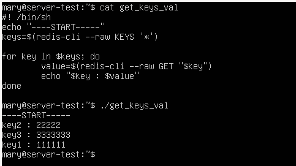

# Домашнее задание к занятию "Кеширование Redis/memcached" - Варфоломеева Марьяна

### Задание 1. Кеширование 

Приведите примеры проблем, которые может решить кеширование. 

---
### Ответ
1. Повышение производительности - достигается за счет складывания в кэш данных, к которым чаще всего происходит обращение
1. Быстрый доступ к медиа-файлам, без необходимости загружать их каждый раз с сервера. Пользователи могут получать их с кэша.
1. Экономия ресурсов базы данных при применении кэширования тяжелых запросов.
1. Сглаживание бустов трафика. Например, во время черной пятницы онлайн-магазины используют кэш, чтобы пережить резкое увеличение трафика.

### Задание 2. Кеширование 

Установите и запустите memcached.

*Приведите скриншот systemctl status memcached, где будет видно, что memcached запущен.*

---
### Ответ

### Задание 3. Удаление по TTL в Memcached

Запишите в memcached несколько ключей с любыми именами и значениями, для которых выставлен TTL 5. 

*Приведите скриншот, на котором видно, что спустя 5 секунд ключи удалились из базы.*

---
### Ответ

### Задание 4. Запись данных в Redis

Запишите в Redis несколько ключей с любыми именами и значениями. 

*Через redis-cli достаньте все записанные ключи и значения из базы, приведите скриншот этой операции.*

### Ответ

Получить все ключи можно через команду SCAN или KEYS
Значения ключей можно получить через команду MGET

Чтобы получить вывод в формате "ключ: значение" можно использовать цикл в баш-скрипте:

    